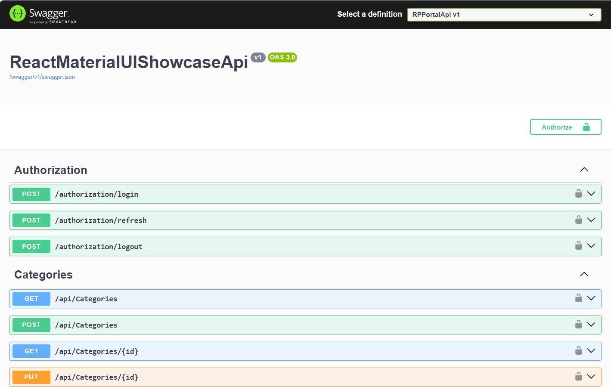

# ReactMaterialUIShowcaseApi
This is the C# controller based Web API project for the ReactMaterialUIShowcase Single Page React Application located at https://github.com/juchertb/ReactMaterialUIShowcase. It is built using ASP.NET Core 9.0 and Entity Framework Core 9.0 with a SQL Server database.

## RESTFul API
To create and update the data model in the database, after compiling the project, run the following from the Terminal in Visual Studio 2022:

1. dotnet ef migrations add init
2. dotnet ef database update

Swagger UI can also be used for API testing.
<br>


## Data model
See Entity Relationship Diagram in ReactMaterialUIShowcaseErd.md: 
[Click here to see the Schema](ReactMaterialUIShowcaseErd.md)

Steps to produce the diagram:
1. Install the "SQL Database Projects" and "SQL Server (mssql)" Microsoft extensions in Visual Studio Code and connect to the database. 
2. Create a new database project and then right-click it and select "Update Project from Database". This will extract the DDL from all tables and save them in separate .sql files under the dbo folder.
3. Combine all the .sql files into a single .sql file and ask Gemini or Copilot to produce the Mermaid code for an ErDiagram from the DDL.
4. Save the Mermaid code to an .md file and use the Markdown Preview function in Visual Studio Code to produce the ER Diagram.
5. The Markdown file on the GitHub repository (online) will also generate the ER Diagram out of the box.

## Technologies Used

**.NET 9**: The API is built using ASP.NET Core targeting .NET 9, leveraging the latest features and performance improvements of the .NET ecosystem.

**C#**: All backend logic, controllers, repositories, and DTOs are implemented in C#.

**Entity Framework Core / Custom Repositories**: Data access is abstracted via repository patterns (e.g., OrdersRepository, CustomersRepository), supporting maintainability and testability.

**JWT Authentication**: Secure authentication and authorization are implemented using JSON Web Tokens (JWT), with support for refresh tokens.

**Logging**: Application events and errors are logged to file using Serilog and the built-in ILogger<T> interface.

**Validation**: Model validation is enforced using data annotations and manual validation logic.

**Configuration**: Environment-specific settings are managed via appsettings.json files.

# Architecture
## Layered Structure
### Controllers
- Expose RESTful endpoints for resources like customers, orders, and authorization.
- Handle HTTP requests, validation, and response formatting (JSON).
### DTOs (Data Transfer Objects)
- Define the shape of data exchanged between client and server.
- Ensure separation between internal models and API contracts.
### Repositories
- Encapsulate data access logic, abstracting database operations.
- Support dependency injection for testability.
### Services
- (e.g., ITokenService) Handle cross-cutting concerns like token generation and validation.
### Middleware & Filters
- Custom attributes (e.g., SetUserCulture) manage localization and request context.
### Authentication & Authorization
- JWT-based, with refresh token support for secure session management.
### Localization
- Error messages and UI strings are localized based on user preference.

## Publishing the Web API to an IIS web site
### Prerequisites
Install the following:
- **ASP.NET Core Hosting Bundle for .NET 9**: Install the "ASP.NET Core Hosting Bundle for .NET 9". The Hosting Bundle installs the ASP.NET Core Module for IIS, which is required to forward web requests from IIS to the ASP.NET Core application. Without it, IIS cannot properly host or launch ASP.NET Core apps.
- **URL Rewrite module**: Install the x64 English version of the URL Rewrite IIS module if not already installed. See URL Rewrite from the Microsoft II site at https://www.iis.net/downloads/microsoft/url-rewrite.

Restart IIS after installation and make sure the web.config file is included in the installation folder otherwise IIS will only serve static files.
### Web application and IIS Setup

1. Install prerequisites ("ASP.NET Core Hosting Bundle for .NET 9" and "URL Rewrite IIS module"). See "Prerequisites" section above.
2. Manually copy the "...\ReactMaterialUIShowcaseApi\bin\Test\net9.0\publish" folder to "E:\inetpub\wwwroot\ReactMaterialUIShowcaseApi" on the server.
3. In IIS create a new application pointing to the folder where you copied the files.
4. Ensure the Application Pool is set to "No Managed Code" (for ASP.NET Core apps). Create a new application pool if necessary.
5. Make sure System environment variables are created and not User environment variables. To be used for connection string and other sensitive settings instead of having them in the appsettings.json
6. Navigate to the Web API URL.
7. Or better use curl from the command prompt to call API endpoints. You will get more information related to the request and response processes.
8. If you get a 500 type of error instead of 401 when trying to retrieve the status without passing the JWT Signing Key, then call iisreset from an admin command prompt. It is likely that the system environment variables are not seen by ASP.NET.

# Authentication and Authorization
The JWT Issuer and Audience settings are stored in the appsettings.json file and are as follow:
```bash
"JWT": {

  "SigningKey": "A_VERY_LONG_RANDOM_STRING_AT_LEAST_64_CHARACTERS_LONG_FOR_SECURITY_PURPOSES_1234567890",

  "Issuer": "https://somedomain.server.ca",

  "Audience": "ReactMaterialUIShowcaseUsers"

},
```
The SigningKey in the config file is used for development only when ReactMaterialUIShowcaseApi is run in debug mode.

> [!Note]
> By default, in TokenService.cs, IConfiguration will resolve values from environment variables, appsettings.json, and other providers, with environment variables taking precedence.

For production, and the other environment, the SigningKey should be generated with the following statement and stored in an environment variable:
```bash
$bytes = New-Object 'Byte[]' 64; (New-Object Security.Cryptography.RNGCryptoServiceProvider).GetBytes($bytes); [Convert]::ToBase64String($bytes)
``` 
For testing purposes, to store the SigningKey in an environment variable from the Command Prompt window use the following statement:
```bash
set JWT__SigningKey=your_base64_key_here
```

And from the Windows PowerShell:
```bash
$env:JWT__SigningKey="your_base64_key_here"
```

# Logging to File with Serilog
The API uses Serilog (https://serilog.net/) to log information and errors to file with the following configuration.

ASP.NET Core logs are routed through Serilog and will be written to the file sink specified (Logs/log-.txt).

In production, to reduce logging to the strict minimum, set the MinimumLevel = Fatal. This should be the default setting, but will not turn off logging completely.


## Key Settings

- **MinimumLevel**: Sets the default minimum log level (e.g., Information).

The MinimumLevel configuration object provides for one of the log event levels to be specified as the minimum. At a minimum the specified level and high will be logged.

|Level|Usage|
|-----|-----|
|Verbose|Verbose is the noisiest level, rarely (if ever) enabled for a production app.|
|Debug|Debug is used for internal system events that are not necessarily observable from the outside, but useful when determining how something happened.|
|Information|Information events describe things happening in the system that correspond to its responsibilities and functions. Generally these are the observable actions the system can perform.|
|Warning|When service is degraded, endangered, or may be behaving outside of its expected parameters, Warning level events are used.|
|Error|When functionality is unavailable or expectations broken, an Error event is used.|
|Fatal|The most critical level, Fatal events demand immediate attention. Default in production.|

**Default Level** - if no MinimumLevel is specified, then Information level events and higher will be processed.

- **WriteTo**: Configures log sinks. Here, logs are written to files in the `Logs` directory, with daily rolling files.
- **Enrich**: Adds extra properties to each log event (e.g., machine name, thread ID).
- **Properties**: Adds static properties to all log events (e.g., application name).

## Useful Resources
https://serilog.net/

https://github.com/serilog/serilog-sinks-file

https://github.com/serilog/serilog/wiki/Configuration-Basics

https://github.com/serilog/serilog-settings-configuration

# Making the Build

Run the following command from the Visual Studio 2022 Developer PowerShell. Switch to the Release configuration before running the build command.

"dotnet publish" creates a deployment-ready output for IIS.

```bash
dotnet publish ReactMaterialUIShowcaseApi.csproj -c Test
```

The output files are located under "...\ReactMaterialUIShowcaseApi\bin\Test\net9.0\publish".

 
