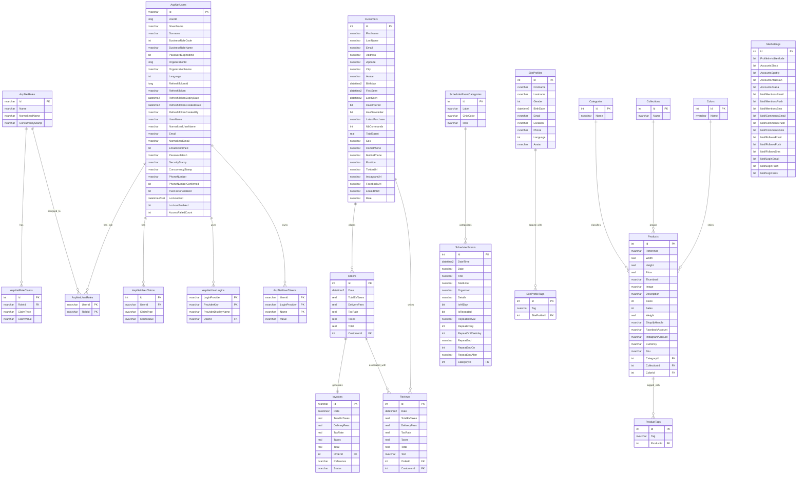

```mermaid
erDiagram
    AspNetRoles ||--o{ AspNetRoleClaims : has
    AspNetRoles ||--o{ AspNetUserRoles : assigned_to
    AspNetUsers ||--o{ AspNetUserRoles : has_role
    AspNetUsers ||--o{ AspNetUserClaims : has
    AspNetUsers ||--o{ AspNetUserLogins : uses
    AspNetUsers ||--o{ AspNetUserTokens : owns

    Customers ||--o{ Orders : places
    Customers ||--o{ Reviews : writes

    Orders ||--|| Invoices : generates
    Orders ||--o{ Reviews : associated_with

    Categories ||--o{ Products : classifies
    Collections ||--o{ Products : groups
    Colors ||--o{ Products : styles

    Products ||--o{ ProductTags : tagged_with

    SchedulerEventCategories ||--o{ SchedulerEvents : categorizes

    SiteProfiles ||--o{ SiteProfileTags : tagged_with

    AspNetRoleClaims {
        int Id PK
        nvarchar RoleId FK
        nvarchar ClaimType
        nvarchar ClaimValue
    }

    AspNetRoles {
        nvarchar Id PK
        nvarchar Name
        nvarchar NormalizedName
        nvarchar ConcurrencyStamp
    }

    AspNetUserClaims {
        int Id PK
        nvarchar UserId FK
        nvarchar ClaimType
        nvarchar ClaimValue
    }

    AspNetUserLogins {
        nvarchar LoginProvider PK
        nvarchar ProviderKey PK
        nvarchar ProviderDisplayName
        nvarchar UserId FK
    }

    AspNetUserRoles {
        nvarchar UserId PK
        nvarchar RoleId PK
    }

    AspNetUsers {
        nvarchar Id PK
        long UserId
        nvarchar GivenName
        nvarchar Surname
        int BusinessRoleCode
        nvarchar BusinessRoleName
        bit PasswordExpiredInd
        long OrganizationId
        nvarchar OrganizationName
        int Language
        long RefreshTokenId
        nvarchar RefreshToken
        datetime2 RefreshTokenExpiryDate
        datetime2 RefreshTokenCreatedDate
        nvarchar RefreshTokenCreatedBy
        nvarchar UserName
        nvarchar NormalizedUserName
        nvarchar Email
        nvarchar NormalizedEmail
        bit EmailConfirmed
        nvarchar PasswordHash
        nvarchar SecurityStamp
        nvarchar ConcurrencyStamp
        nvarchar PhoneNumber
        bit PhoneNumberConfirmed
        bit TwoFactorEnabled
        datetimeoffset LockoutEnd
        bit LockoutEnabled
        int AccessFailedCount
    }

    AspNetUserTokens {
        nvarchar UserId PK
        nvarchar LoginProvider PK
        nvarchar Name PK
        nvarchar Value
    }

    Categories {
        int Id PK
        nvarchar Name
    }

    Collections {
        int Id PK
        nvarchar Name
    }

    Colors {
        int Id PK
        nvarchar Name
    }

    Customers {
        int Id PK
        nvarchar FirstName
        nvarchar LastName
        nvarchar Email
        nvarchar Address
        nvarchar Zipcode
        nvarchar City
        nvarchar Avatar
        datetime2 Birthday
        datetime2 FirstSeen
        datetime2 LastSeen
        bit HasOrdered
        bit HasNewsletter
        nvarchar LatestPurchase
        int NbCommands
        real TotalSpent
        nvarchar Sex
        nvarchar HomePhone
        nvarchar MobilePhone
        nvarchar Position
        nvarchar TwitterUrl
        nvarchar InstagramUrl
        nvarchar FacebookUrl
        nvarchar LinkedInUrl
        nvarchar Role
    }

    Invoices {
        nvarchar Id PK
        datetime2 Date
        real TotalExTaxes
        real DeliveryFees
        real TaxRate
        real Taxes
        real Total
        int OrderId FK
        nvarchar Reference
        nvarchar Status
    }

    Orders {
        int Id PK
        datetime2 Date
        real TotalExTaxes
        real DeliveryFees
        real TaxRate
        real Taxes
        real Total
        int CustomerId FK
    }

    Products {
        int Id PK
        nvarchar Reference
        real Width
        real Height
        real Price
        nvarchar Thumbnail
        nvarchar Image
        nvarchar Description
        int Stock
        int Sales
        real Weight
        nvarchar ShopifyHandle
        nvarchar FacebookAccount
        nvarchar InstagramAccount
        nvarchar Currency
        nvarchar Sku
        int CategoryId FK
        int CollectionId FK
        int ColorId FK
    }

    ProductTags {
        int Id PK
        nvarchar Tag
        int ProductId FK
    }

    Reviews {
        int Id PK
        datetime2 Date
        real TotalExTaxes
        real DeliveryFees
        real TaxRate
        real Taxes
        real Total
        nvarchar Text
        int OrderId FK
        int CustomerId FK
    }

    SchedulerEventCategories {
        int Id PK
        nvarchar Label
        nvarchar ChipColor
        nvarchar Icon
    }

    SchedulerEvents {
        int Id PK
        datetime2 DateTime
        nvarchar Date
        nvarchar Title
        nvarchar StartHour
        nvarchar Organizer
        nvarchar Details
        bit IsAllDay
        bit IsRepeated
        nvarchar RepeatInterval
        int RepeatEvery
        int RepeatOnWeekday
        nvarchar RepeatEnd
        int RepeatEndOn
        nvarchar RepeatEndAfter
        int CategoryId FK
    }

    SiteProfiles {
        int Id PK
        nvarchar Firstname
        nvarchar Lastname
        int Gender
        datetime2 BirthDate
        nvarchar Email
        nvarchar Location
        nvarchar Phone
        int Language
        nvarchar Avatar
    }

    SiteProfileTags {
        int Id PK
        nvarchar Tag
        int SiteProfileId FK
    }

    SiteSettings {
        int Id PK
        bit ProfileInvisibleMode
        bit AccountsSlack
        bit AccountsSpotify
        bit AccountsAtlassian
        bit AccountsAsana
        bit NotifMentionsEmail
        bit NotifMentionsPush
        bit NotifMentionsSms
        bit NotifCommentsEmail
        bit NotifCommentsPush
        bit NotifCommentsSms
        bit NotifFollowsEmail
        bit NotifFollowsPush
        bit NotifFollowsSms
        bit NotifLoginEmail
        bit NotifLoginPush
        bit NotifLoginSms
    }
```
